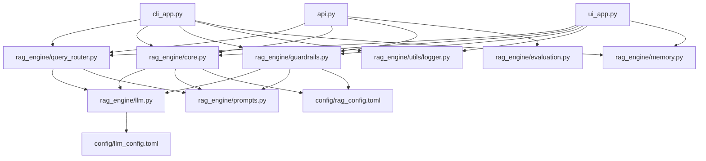

# RAG Engine Code Workflow

This document explains the technical architecture, directory structure, module responsibilities, and step-by-step execution flow of the `rag_engine` library.

---

## Directory Structure

```
rag_agent_v2/
├── config/
│   ├── llm_config.toml         # LLM provider definitions: local model, cloud endpoints, provider order, timeouts
│   └── rag_config.toml         # All RAG pipeline parameters: chunking, retrieval, generation, guardrails, vector store, logging
├── input_files/                # Place documents here for ingestion (.pdf, .html, .md, .txt, .py, .js)
├── local_models/               # Auto-downloaded Hugging Face models (embedder + cross-encoder)
├── logs/                       # Query telemetry in JSONL format (consumed by RAGAS evaluator)
├── chroma_db/                  # Persistent vector store directory (auto-created in persist mode)
├── rag_engine/
│   ├── __init__.py             # Module exports, ColoredFormatter, configure_logging(), ZoedepthWarningFilter
│   ├── cli.py                  # REPLManager: interactive CLI loop with /command routing
│   ├── core.py                 # RAGCoreEngine: parsers, semantic chunker, hybrid search, in-memory + persist ops
│   ├── evaluation.py           # RagasEvaluator: offline quality metrics from telemetry logs
│   ├── guardrails.py           # GuardrailsManager: citation validation, faithfulness check, self-correction loop
│   ├── ingestion.py            # IngestionCoordinator: directory scanning, SHA-256 change detection, full reindex
│   ├── llm.py                  # LiteLLMClient: multi-provider completion/embedding/reranking with fallback chain
│   ├── memory.py               # ConversationMemory: sliding-window chat history
│   ├── metrics.py              # LLMMetricsCollector: per-call token/timing breakdowns
│   ├── prompts.py              # All prompt templates in one place (7 prompts)
│   ├── query_router.py         # QueryRouter: classifies input intent (RAG_RETRIEVAL vs DIRECT_LLM)
│   ├── ui.py                   # Streamlit UI components: chat renderer, source cards, citation map display
│   ├── utils/
│   │   └── logger.py           # QueryLogger: async JSONL file logger
│   └── vector_store.py         # VectorStore: ChromaDB lifecycle, ingestion ledger, collection swap
├── tests/                      # pytest suite (17+ tests covering core, guardrails, LLM, evaluation, logger)
├── api.py                      # FastAPI application with /ingest, /query, /eval endpoints
├── cli_app.py                  # CLI entry point — initializes all components, runs REPL loop
├── ui_app.py                   # Streamlit entry point — sidebar, chat UI, ingestion browser, maintenance tools
└── pyproject.toml              # Project metadata + uv-managed dependencies
```

---

## Dependency Graph



---

## Module Responsibilities

### `config/llm_config.toml`
- Declares operational profiles for LLMs: `llm.mode` (`"local"` or `"cloud"`), local model path, base URL
- Specifies `provider_order` list (e.g., `["nvidia", "gemini", "openrouter"]`) for ordered cloud fallback
- Configures per-provider timeouts

### `config/rag_config.toml`
- `[chunking]` — `max_chunk_size` (default 1500), `k` (semantic threshold multiplier)
- `[retrieval]` — `top_n`, `use_hyde`, `rrf_k`, `rrf_weight_sparse`, `rrf_weight_dense`
- `[generation]` — `temperature`, `max_tokens`
- `[guardrails]` — `max_attempts` (self-correction iterations)
- `[models]` — Hugging Face repo IDs + local directories for embedder and reranker
- `[vector_store]` — `mode` (`"in-memory"` or `"persist"`), `persist_dir`, `collection_name`
- `[logging]` — `level` (`DEBUG`, `INFO`, `WARNING`, `ERROR`)

---

### `rag_engine/prompts.py`
Central repository for all LLM instructions. Contains 7 prompts:

| Constant | Purpose |
|---|---|
| `HYDE_GENERATION_PROMPT` | Instructs the LLM to write a hypothetical document matching the query, used for HyDE query expansion |
| `CITATION_GENERATION_PROMPT` | Directs the LLM to answer strictly from context with `[Doc-X, p. Y]` citations |
| `FAITHFULNESS_CHECK_PROMPT` | Asks the LLM to evaluate each claim in the answer against the context, returning structured JSON |
| `SELF_CORRECTION_REWRITE_PROMPT` | Provides contradiction details and asks the LLM to rewrite the answer faithfully |
| `QUERY_ROUTER_PROMPT` | Classifies user input as `RAG_RETRIEVAL` or `DIRECT_LLM` using few-shot examples and JSON schema |
| `DIRECT_LLM_SYSTEM_PROMPT` | Lightweight conversational system prompt for bypassed (non-RAG) responses |

---

### `rag_engine/llm.py` — `LiteLLMClient`
- Wraps the LiteLLM library for multi-provider completion/embedding/reranking
- **Embedding**: Local `sentence-transformers/all-MiniLM-L6-v2` with automatic Hugging Face download; cloud fallback through the provider chain
- **Completion**: Cloud path iterates `provider_order` from `llm_config.toml` (nvidia → gemini → openrouter → huggingface → deepseek → openai → anthropic); local path uses Ollama/vLLM endpoint
- **Reranking**: Local `cross-encoder/ms-marco-MiniLM-L-6-v2` with Hugging Face auto-download
- **Metrics**: Accepts optional `LLMMetricsCollector` and `purpose` string; logs token counts and timing at `DEBUG` level
- All API keys read from lowercase environment variables (`hf_api_key`, `nvidia_api_key`, `gemini_api_key`, etc.)

---

### `rag_engine/query_router.py` — `QueryRouter`
- Intercepts every user query before it reaches the vector search
- Calls `llm_client.acompletion()` with `QUERY_ROUTER_PROMPT` at `temperature=0.0`
- Parses JSON response; on any parse failure defaults to `"RAG_RETRIEVAL"`
- Returns `{"route": "RAG_RETRIEVAL" | "DIRECT_LLM", "reasoning": "..."}`
- Logs every routing decision at INFO level
- DIRECT_LLM queries bypass search, guardrails, and citation pipeline entirely — answered by a lightweight system prompt

---

### `rag_engine/core.py` — `RAGCoreEngine`
- **Parsers**: `.pdf` via `pypdf` (page-level extraction); `.html` via `BeautifulSoup`; `.md`, `.txt`, `.py`, `.js` as plain text
- **Semantic Chunker**: Splits at sentence boundaries where cosine distance between adjacent sentence embeddings exceeds `mean + k * std`
- **Parent-Document Store**: Maps child chunk IDs to parent documents; persisted as `parent_store.json` in persist mode
- **Hybrid Retriever**: BM25 sparse scores + dense cosine similarity → RRF fusion → cross-encoder reranking
- **Vector Store Modes**:
  - `"in-memory"`: All data lives in `self.child_nodes` (list of dicts) and `self.parent_store` (dict). BM25 rebuilt on every ingest. No persistence across restarts.
  - `"persist"`: ChromaDB backend with `hnsw:space=cosine`. Data loaded into memory on startup. Ingestion writes to both ChromaDB and in-memory. SHA-256 ledger tracks file changes. Embedding model consistency verified on startup.
- **Deduplication**: `_purge_file()` removes existing entries before re-ingesting. `deduplicate()` removes exact-text duplicates keyed by `(text, source, page_number)`, also cleans ChromaDB. `_init_persist()` auto-deduplicates during startup load.
- **Dedicated methods**: `ingest_file()` (in-memory), `_ingest_file_persist()` (ChromaDB), `search()` (shared), `clean_database()`, `deduplicate()`

---

### `rag_engine/guardrails.py` — `GuardrailsManager`

The guardrails system implements a **three-stage hallucination defense**:

- **Stage 1 — Prevention (`CITATION_GENERATION_PROMPT`)**: Prompts the LLM to produce answers with `[Doc-X, p. Y]` inline citations, grounded strictly in the retrieved context. This is the first line of defense — it sets strict boundaries before the LLM writes the answer.
- **Stage 2 — Detection (`FAITHFULNESS_CHECK_PROMPT`)**: Sends the answer + context to the LLM with the faithfulness prompt, which receives a JSON report enumerating each atomic claim and whether it is supported. Acts as the automated judge that catches fabrications that slipped through prevention.
- **Stage 3 — Correction (`SELF_CORRECTION_REWRITE_PROMPT`)**: If faithfulness fails, rewrites the answer using the rewrite prompt, providing specific contradictions identified by the detection stage. Then re-validates. Repeats up to `max_attempts` (default 3).

Other responsibilities:
- **Citation Validation**: Parses all `[Doc-X]` and `[Doc-X, p. Y]` references from the answer, validates indices against the context list, and checks page number bounds
- **LLM Metrics Collection**: Creates an `LLMMetricsCollector` at the start of each query, threads it through every `acompletion()` call, and returns `llm_metrics` in the result dict.
- **Citation Map**: `build_citation_map(answer, contexts)` parses all citation references from the final answer and maps each `[Doc-X, p. Y]` to the corresponding source filename, page, and score. Exposed via `__init__.py`.

---

### `rag_engine/evaluation.py` — `RagasEvaluator`
- Reads query telemetry from `logs/query_log.jsonl`
- Uses synchronous `SyncRagasEmbeddings` wrapper (avoids uvloop thread-pool deadlock with Streamlit)
- Calls `await aevaluate()` directly (not `evaluate()`) to avoid nested event loop issues
- Computes: `faithfulness`, `answer_relevancy`, `context_precision`, `context_recall`
- Pads missing metrics with `None` when `ground_truth` metadata is absent
- Returns `{"evaluation_type": "ragas", ...}` on success, `{"status": "..."}` on fallback

---

### `rag_engine/metrics.py` — `LLMMetricsCollector`
- Dataclass `LLMCallMetrics`: purpose, elapsed_ms, prompt_tokens, completion_tokens, total_tokens
- Collector class accumulates per-call data, exposes `to_dict()` (JSON-serializable) and `format_per_call_breakdown()` (human-readable string)
- Used by `guardrails.py` to instrument every LLM call during answer generation
- Displayed in CLI (colored table), Streamlit UI (metric cards + expander), and API JSON response

---

### `rag_engine/memory.py` — `ConversationMemory`
- Sliding window of recent conversation turns
- `window_size` (default 5) controls how many user/assistant pairs are retained
- `format_history()` renders the message list as a formatted string for inclusion in LLM prompts
- Passed into `guardrails.generate_faithful_answer()` via `chat_history` parameter

---

### `rag_engine/vector_store.py` — `VectorStore`
- ChromaDB wrapper with `PersistentClient` and `hnsw:space=cosine` configuration
- **Collection Lifecycle**: `initialize()`, `delete_all()`, `create_new_collection()`, `drop_collection()`, `swap_collection()`
- **Ingestion Ledger**: `chroma_ingestion_logger.json` tracks per-file SHA-256 hash, modification time, and chunk IDs — enables incremental updates
- **Embedding Model Tracking**: Stored in collection metadata, verified on startup to detect model changes
- **Chunk Operations**: `add_chunks()`, `add_chunks_batch()`, `delete_document()`, `get_all_chunks()`, `get_all_texts()`
- **Parent Store**: JSON serialization/deserialization of parent documents to disk

---

### `rag_engine/ingestion.py` — `IngestionCoordinator`
- Directory scanner with extension filtering (`.pdf`, `.html`, `.htm`, `.md`, `.markdown`, `.txt`, `.py`, `.js`)
- Incremental update detection: compares current SHA-256 against ledger entry
- `ingest_path()` — single file or directory entry point
- `full_reindex()` — creates new ChromaDB collection, reprocesses all files, atomically swaps collections
- `verify_model_consistency()` — checks that the persisted collection matches the configured embedding model
- Files are processed through `core_engine.parse_file()` → `core_engine.chunk_semantically()` → `llm_client.aembedding()` → `vector_store.add_chunks_batch()`

---

### `rag_engine/utils/logger.py` — `QueryLogger`
- Async JSONL logger appends query records to `logs/query_log.jsonl`
- Each record contains: query, response, retrieved nodes, latency, metadata
- Consumed by `RagasEvaluator` for offline evaluation

---

## Application Entry Points

### `cli_app.py` — CLI
- Initializes all components at module level (`LiteLLMClient`, `RAGCoreEngine`, `GuardrailsManager`, `QueryRouter`, `QueryLogger`, `ConversationMemory`)
- `query_callback()`: Routes query → if DIRECT_LLM calls LLM directly → if RAG_RETRIEVAL runs search + guardrails → streams answer → yields citation map, source listing, and metrics
- `ingest_callback()`: Walks directory or single file, calls `core_engine.ingest_file()`
- `model_callback()`: Switches the active model
- Accepts `--ingest-path` for pre-ingestion on startup
- Runs `REPLManager.start_interactive_loop()` for interactive `/command` processing

### `ui_app.py` — Streamlit
- Custom Meta Blue CSS theme injected at startup
- Sidebar: file browser, ingestion button, dedup button, clean DB button (with confirmation popover), RAGAS evaluation button, database stats display
- Pending query flow: Route query → if DIRECT_LLM calls LLM directly and renders → if RAG_RETRIEVAL runs search in `st.status()` card → guardrails → render answer + citation map + sources + metrics
- State managed via `st.session_state` (chat history, memory, generating flag)

### `api.py` — FastAPI
- `/ingest` POST: accepts `{"path": "..."}`, calls `core_engine.ingest_file()`, returns doc_id + duration
- `/query` POST: accepts `QueryRequest` (query, model, top_n, use_hyde, history), routes query → if DIRECT_LLM returns early → if RAG_RETRIEVAL runs search + guardrails, returns answer + retrieved_nodes + citation_map + llm_metrics
- `/eval` GET: runs `RagasEvaluator.evaluate_ragas()`, returns metrics dict

---

## Step-by-Step Query Execution Flow

```
User Input
    │
    ▼
1. QUERY ROUTING (QueryRouter.route_query)
   │   temperature=0.0, max_tokens=128
   │
   ├──► DIRECT_LLM
   │     │  Call LLM with lightweight system prompt
   │     │  Return answer directly (no search, no guardrails)
   │     ▼
   │   Output: conversational response, no citations
   │
   └──► RAG_RETRIEVAL  ──►  continue to step 2
   
   2. HYBRID SEARCH (RAGCoreEngine.search)
   │
   ├───► [If use_hyde=true]  ──►  LLM generates hypothetical document  ──►  Embed document
   │                                                                          │
   └───► [If use_hyde=false] ─────────────────────────────────────────────────┼──► Embed query
                                                                               │
   ┌──────────────────────────────────────────────────────────────────────────┘
   ▼
   ├───► 2a. Sparse Retrieve: BM25 keyword scores
   ├───► 2b. Dense Retrieve: Cosine similarity against all chunk embeddings
   │
   ▼
   3. RRF FUSION
   │   Combine sparse and dense rank arrays
   │   score = rrf_weight_sparse / (rrf_k + rank_sparse)
   │         + rrf_weight_dense  / (rrf_k + rank_dense)
   ▼
   4. TOP-N SELECTION
   │   Select highest-scoring child nodes
   ▼
    5. CROSS-ENCODER RERANKING
    │   Neural reranker re-scores candidates
    │   Scale logits to [0.0, 1.0] via sigmoid
    ▼
    6. GUARDRAILS PIPELINE (three-stage hallucination defense)
    │
    ├───► STAGE 1 — PREVENTION
    │     6a. Generate initial answer with CITATION_GENERATION_PROMPT
    │         Every claim grounded with [Doc-X, p. Y]
    │         Sets strict boundaries before LLM writes the answer
    │
    ▼
    7. STAGE 2 — DETECTION (ITERATIVE VALIDATION LOOP, up to max_attempts)
    │
    ├───► 7a. Parse and validate all [Doc-X, p. Y] citations
    │         - Doc index within bounds
    │         - Page number matches source
    │
    ├───► 7b. Faithfulness check via FAITHFULNESS_CHECK_PROMPT
    │         JSON output: per-claim supported/contradiction flags
    │         Breaks answer into atomic claims, catches fabrications
    │
    ├───► [PASS] ─► Continue to step 8
    │
    └───► [FAIL] ─► STAGE 3 — CORRECTION (SELF_CORRECTION_REWRITE_PROMPT)
                    │   Takes specific contradictions from Stage 2
                    │   Forces LLM to rewrite, stripping ungrounded text
                    └──► Retry from step 7a (Stage 2)
   
   8. OUTPUT CONSTRUCTION
   │
   ├───► Answer with preserved [Doc-X, p. Y] citations
   ├───► Citation map: { "[Doc-0, p. 5]": {"filename": "...", "page": 5, "score": 0.9} }
   ├───► Source listing with filenames, pages, scores
   ├───► LLM Metrics: per-call breakdown (purpose, tokens, elapsed)
   └───► Logged to telemetry + stdout
```

---

## Prompt Flow Summary

```
QUERY_ROUTER_PROMPT ──► (classifies input)
                            │
                            ▼ (if RAG_RETRIEVAL)
╔══════════════════════════════════════════════╗
║       THREE-STAGE HALLUCINATION DEFENSE      ║
╠══════════════════════════════════════════════╣
║ STAGE 1 — PREVENTION                         ║
║ CITATION_GENERATION_PROMPT ──► (generates    ║
║   answer with [Doc-X, p. Y] citations,       ║
║   grounded strictly in context)              ║
╠══════════════════════════════════════════════╣
║ STAGE 2 — DETECTION                          ║
║ FAITHFULNESS_CHECK_PROMPT ──► (evaluates     ║
║   atomic claims against context, returns     ║
║   JSON with per-claim supported flags)       ║
╠══════════════════════════════════════════════╣
║                     │                         ║
║             ┌───────┴───────┐                ║
║             ▼               ▼                ║
║           PASS            FAIL               ║
║             │               │                ║
║             │    STAGE 3 — CORRECTION        ║
║             │    SELF_CORRECTION_REWRITE_    ║
║             │    PROMPT (rewrite with        ║
║             │    specific contradictions,    ║
║             │    then re-check from Stage 2) ║
║             ▼               │                ║
║       Return answer   ──────┘ (up to         ║
║                           max_attempts)      ║
╚══════════════════════════════════════════════╝
```

---

## Vector Store Modes

### In-Memory (default)
- `[vector_store].mode = "in-memory"` in `rag_config.toml`
- All chunks stored in `RAGCoreEngine.child_nodes` (Python list of dicts)
- BM25 index rebuilt on every ingest
- No data persistence across restarts
- Suitable for development, testing, and small document sets

### Persist (ChromaDB)
- `[vector_store].mode = "persist"` in `rag_config.toml`
- Chunks stored in ChromaDB with `hnsw:space=cosine` index
- SHA-256 ingestion ledger tracks file changes for incremental updates
- Data survives restarts — loaded into memory on startup
- Dedup runs automatically on startup to clean any stale duplicates
- `IngestionCoordinator` handles incremental scans and full reindex with atomic collection swap
- Switching modes mid-session is not supported (data not migrated)

---

## Telemetry & Evaluation

### Query Logging
Every query is logged asynchronously to `logs/query_log.jsonl` with:
- Query text and response
- Retrieved context chunks (text, filename, page, score)
- Latency and metadata
- Routing decision and faithfulness status

### RAGAS Offline Evaluation
1. Ensure queries have been run (logs populate `logs/query_log.jsonl`)
2. Trigger evaluation via API: `GET /eval` or
3. Call `RagasEvaluator().evaluate_ragas()` programmatically
4. Metrics returned: `faithfulness`, `answer_relevancy`, `context_precision`, `context_recall`
5. `context_precision` and `context_recall` require `ground_truth` metadata in log entries

---

## Configuration Reference

### Environment Variables
All API keys are lowercase:
```
hf_api_key, nvidia_api_key, gemini_api_key, openai_api_key,
anthropic_api_key, deepseek_api_key, openrouter_api_key
```

### Key Configuration Defaults
| Parameter | Default | Description |
|---|---|---|
| `chunking.max_chunk_size` | 1500 | Maximum characters per chunk |
| `chunking.k` | 1.0 | Semantic threshold multiplier (std devs) |
| `retrieval.top_n` | 3 | Number of chunks to retrieve |
| `retrieval.rrf_k` | 60 | RRF penalty constant |
| `retrieval.use_hyde` | false | Hypothetical Document Embedding toggle |
| `generation.temperature` | 0.0 | LLM temperature |
| `generation.max_tokens` | 512 | Max tokens in generated answer |
| `guardrails.max_attempts` | 3 | Self-correction loop limit |
| `vector_store.mode` | in-memory | Vector store backend |
| `logging.level` | INFO | Log verbosity |
