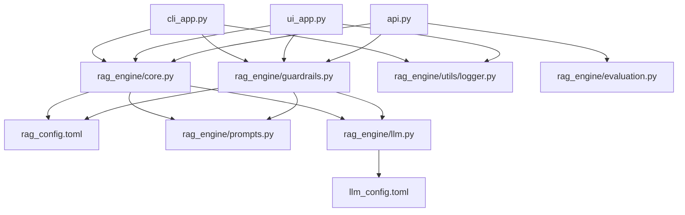

# RAG Engine Code Workflow

This document explains the technical details, code architecture, directory structure, module responsibilities, and step-by-step query execution flow of the `rag_engine` library.

---

## Directory Structure

```
rag_agent_v2/
├── .streamlit/
│   └── config.toml             # Custom Meta Blue Streamlit theme setup
├── config/
│   ├── llm_config.toml         # Local LLM, Cloud LLM config & ordered providers
│   └── rag_config.toml         # Chunking, Retrieval, Generation, and Guardrails config
├── input_files/                # Ingestible files repository
├── local_models/               # Automatically downloaded embedder & reranker files
├── logs/                       # Telemetry metrics output logs
├── rag_engine/
│   ├── __init__.py             # Module namespace registrations
│   ├── cli.py                  # CLI controller and loop handlers
│   ├── core.py                 # Parsers, chunker, indexer, retrieval and reranking logic
│   ├── evaluation.py           # Telemetry metrics evaluator (Ragas & fallback metrics)
│   ├── guardrails.py           # Citation validation and faithfulness self-correction loops
│   ├── llm.py                  # LiteLLM client, local downloading, and Cloud fallbacks
│   ├── prompts.py              # Externalized system & generation templates
│   ├── ui.py                   # Streamlit layout styling fragments
│   └── utils/
│       ├── __init__.py
│       └── logger.py           # Async file logger for telemetry outputs
├── tests/                      # pytest verification suite
├── api.py                      # FastAPI microservice
├── cli_app.py                  # Click terminal REPL interface
├── ui_app.py                   # Streamlit custom web app
└── pyproject.toml              # Project dependencies managed by uv
```

---

## Technical Architecture & Dependency Flow



---

## Detailed File Workflows & Module Responsibilities

### 1. Configuration Layer

#### `config/llm_config.toml`
* **Purpose**: Declares the operational profiles of LLMs (local vs. cloud router endpoints).
* **Details**:
  * Configures `llm.mode` (determines default fallback routing: `"local"` vs. `"cloud"`).
  * Exposes local parameters (base url and local model path).
  * Specifies `provider_order` list (e.g. `["nvidia", "gemini", "openrouter"]`) and specific request timeouts for the ordered cloud router traversal.

#### `config/rag_config.toml`
* **Purpose**: Consolidates all parameters of the RAG pipeline.
* **Details**:
  * `[chunking]`: Sets parsing rules (`max_chunk_size`, standard deviation threshold `k` for semantic clustering).
  * `[retrieval]`: Adjusts context outputs (`top_n`, `use_hyde`, RRF penalty metric `rrf_k`, and hybrid weights `rrf_weight_sparse` / `rrf_weight_dense`).
  * `[generation]`: Adjusts LLM response variables (`temperature` and `max_tokens` limits).
  * `[guardrails]`: Exposes self-correction loop rules (`max_attempts`).
  * `[models]`: Maps Hugging Face repository source IDs and destination folders for embedding and reranking assets.

---

### 2. Core RAG Pipeline

#### `rag_engine/prompts.py`
* **Purpose**: Serves as the central repository for LLM instructions.
* **Details**:
  * `HYDE_GENERATION_PROMPT`: Instructs LLMs to write hypothetical candidate documents matching queries.
  * `CITATION_GENERATION_PROMPT`: Directs LLMs to ground responses strictly within context sources, enforcing `[Doc-X, p. Y]` reference formatting.
  * `FAITHFULNESS_CHECK_PROMPT`: Instructs checking models to verify generated claims against source texts, returning a structured JSON faithfulness report.
  * `SELF_CORRECTION_REWRITE_PROMPT`: Outlines contradiction lists and prompts corrective rewrites.

#### `rag_engine/llm.py`
* **Purpose**: Interfaces with LLM providers using the LiteLLM library.
* **Details**:
  * Manages the execution environment lifecycle.
  * Downloads model files automatically from Hugging Face if missing local directories using `hf_api_key`.
  * **Dynamic Provider Resolution**: Automatically inspects base URLs to register custom API formats (e.g. OpenAI compatibility for NVIDIA NIMs).
  * **Ordered Cloud Fallback Traversal**: Iterates sequential providers during cloud timeout failures until a healthy endpoint completes successfully.

#### `rag_engine/core.py`
* **Purpose**: Manages document processing, semantic indexing, hybrid retrieval, and neural reranking.
* **Details**:
  * **Parsers**: Custom extraction logic for `.pdf` (using `pypdf`), `.html` (using `BeautifulSoup`), and general code/text.
  * **Semantic Chunker**: Implements dynamic clustering based on statistical rolling differences in sentence embedding vectors.
  * **Parent-Document Store**: Links short child nodes to their corresponding parent documents.
  * **Hybrid Retriever**: Retrieves candidate matches from both BM25 indexes (sparse keyword matches) and cosine-similarity lookups (dense semantic vectors).
  * **Reciprocal Rank Fusion (RRF)**: Merges rank arrays using sparse/dense multipliers (`rrf_weight_sparse` / `rrf_weight_dense`).
  * **Sigmoid Logits Scaling**: Maps raw neural cross-encoder outputs (typically spanning `[-inf, inf]`) to normalized probability bounds `[0.0, 1.0]` to ensure score display readability on the UI.

#### `rag_engine/guardrails.py`
* **Purpose**: Performs real-time validation checks and self-correction loops.
* **Details**:
  * Parses citation formatting and checks them against retrieved document indices and page bounds.
  * Calls faithfulness evaluators to check output claims against the context sources.
  * Iteratively corrects and rewrites the answer up to `max_attempts` if failures occur.
  * Strips citation markup brackets `[Doc-X, p. Y]` from the final response text before outputting.

---

### 3. Application & Presentation Layer

#### `ui_app.py`
* **Purpose**: Exposes the visual dashboard for user interactions.
* **Details**:
  * Injects a custom CSS theme to set button styles, container borders, sidebar aesthetics, scrollbar paths, and avatar colors to Meta Blue (`#0064e0`).
  * Locks inputs during query runtime to prevent concurrent submissions.
  * Runs `st.status()` containers to stream real-time thought logs, displaying details about retrieval and self-correction iterations.

#### `cli_app.py`
* **Purpose**: Exposes a command-line REPL shell environment.
* **Details**:
  * Leverages Click/Typer packages to interpret interactive user queries.
  * Handles `/ingest`, `/query`, and `/eval` commands, printing query results directly to the console.

#### `api.py`
* **Purpose**: Exposes a FastAPI endpoint service.
* **Details**:
  * Exposes POST interfaces `/ingest`, `/query` and GET interface `/eval` to support external API clients.

#### `rag_engine/evaluation.py`
* **Purpose**: Telemetry evaluation suite.
* **Details**:
  * Evaluates system telemetry files to compute faithfulness, relevance, precision, and recall metrics using RAGAS or math fallback routines.

---

## Detailed Step-by-Step Query Execution Flow

```
 User Input
     │
     ▼
 ui_app.py  ──►  Disable Chat Input (Blocks Double-Submit)
     │
     ▼
 rag_engine/core.py (RAGCoreEngine.search)
     │
     ├───► [If use_hyde=true]  ──►  Call LLM for Hypothetical Answer  ──► Embed Answer
     │                                                                       │
     └───► [If use_hyde=false] ──────────────────────────────────────────────┼──► Embed Query
                                                                             │
     ┌───────────────────────────────────────────────────────────────────────┘
     ▼
 ┌───┴────────────────────────────────────────┐
 │ 1. Sparse Retrieve: BM25 score query      │
 │ 2. Dense Retrieve: Cosine similarity score │
 └───┬────────────────────────────────────────┘
     │
     ▼
 Reciprocal Rank Fusion (RRF)
     │   Multiply Sparse/Dense ranks by configurable rrf_weight keys.
     ▼
 Retrieve Top-N Child Nodes ──► Map to Parent Document Contexts
     │
     ▼
 Cross-Encoder Reranking
     │   Score chunks using local cross-encoder model.
     ├───► Scale Reranker Logits to [0.0 - 1.0] range using Sigmoid.
     ▼
 rag_engine/guardrails.py (GuardrailsManager.generate_faithful_answer)
     │
     ├───► Step A: Generate initial response from LLM containing citations ([Doc-X, p. Y])
     │
     ▼
  Iterative Validation Loop (Runs up to `max_attempts`):
     │
     ├───► Step B: Parse and validate citations format and boundaries.
     ├───► Step C: Query LLM faithfulness check (JSON output matching claims).
     │
     ├─► [PASS] ─► Strip citation brackets ─► Return Clean Response ─► Enable Input
     │
     └─► [FAIL] ─► Self-Correct / Rewrite response based on contradiction report ─► Retry Loop
```

---

## 4. Telemetry & Evaluation

### OpenSmith Telemetry
OpenSmith telemetry captures performance metrics, inputs, and outputs across key operations. 
To launch the OpenSmith Tracing UI locally, run:
```bash
opensmith --port 7824
```
Access the dashboard at [http://127.0.0.1:7824](http://127.0.0.1:7824).

Once the service is running, any queries run via the CLI, Streamlit UI, or API endpoints will automatically generate trace nodes under tags like `core_engine`, `guardrails`, and `llm_client`.

### Ragas Evaluation
Ragas evaluation allows offline validation of RAG pipeline quality using core metrics: Faithfulness, Answer Relevancy, Context Precision, and Context Recall.

#### Execution Steps:
1. Ensure you have run some queries through the application so that telemetry/query logs are generated in `logs/query_log.jsonl`.
2. Start the API server:
   ```bash
   uv run uvicorn api:app --reload --port 8000
   ```
3. Trigger the evaluation endpoint:
   ```bash
   curl http://127.0.0.1:8000/eval
   ```
   Alternatively, run the evaluation asynchronously in your scripts by instantiating the `RagasEvaluator` class:
   ```python
   from rag_engine.evaluation import RagasEvaluator
   evaluator = RagasEvaluator()
   scores = await evaluator.evaluate_ragas()
   print("Ragas Scores:", scores)
   ```
